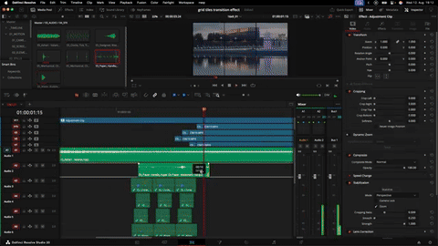

# DaVinci Resolve: Grid Tile Transition (No Fusion)

> **Technique:** Grid / tile stagger reveal transition  
> **Source:** Max Jung — "How to Create a Grid Transition in DaVinci Resolve — No Fusion"  
> **Video:** <https://youtu.be/w8Vjg3-KQ7g> (6:24)  
> **DaVinci Page:** Edit only — no Fusion, no Color nodes  
> **Difficulty:** Beginner-Intermediate  
> **Time:** 20–40 minutes

---

## 🎬 Technique Overview

The outgoing clip holds while the incoming clip appears tile-by-tile through a 3×3 grid — an Instagram-style tile reveal built entirely on the **Edit page**. Nine cropped duplicates of the incoming clip are staggered 1 frame apart in any order you choose (bottom→top, left→right, diagonals), with a 1-frame **Add-mode flash** on each tile entry plus click/pop SFX.

**Key Insight:** Never move the duplicates spatially — only slip/trim their timing. All nine copies must stay in sync or the reassembled frame breaks apart.



---

## 🏗️ Timeline Layout

```
VIDEO 3 — Adjustment Clip (full transition span) + Grid ResolveFX (3x3, black, thin)
VIDEO 2 — Incoming clip ×9 stacked (each cropped to 1 tile, staggered 1 frame apart)
VIDEO 1 — Outgoing clip (holds underneath until reveal starts)
```

---

## ⚙️ Step-by-Step Procedure

### Step 1 — Grid guide (0:12)

| Tool | Action | Why |
|------|--------|-----|
| Effects Library → Adjustment Clip | Drag above the cut, spanning the whole transition | Hosts the grid overlay |
| Effects Library → Resolve FX → Grid | Drag onto the adjustment clip | Tile guides; must be under **Resolve effects**, not OpenFX |
| Inspector → Rows / Column Cells | Set 3 and 3 (or 2×2, 5×5) | Tile count |
| Inspector → Line Color / Width | Black, thin lines | Clean tile separators |

### Step 2 — Nine cropped tiles (1:33–3:30) ⭐

| Tool | Action | Why |
|------|--------|-----|
| Incoming clip | Overlap it against the outgoing clip; drag the overlap region forward | Creates working room for the stagger |
| Option-drag (or copy/paste) | Duplicate the incoming clip 8 more times → 9 stacked copies | One copy per tile |
| Select 8, press `D` (or right-click → Enable/Disable) | Disable all except the first | Work tile-by-tile |
| Inspector → Crop (Left/Right/Top/Bottom) | Crop the enabled clip to exactly one grid cell; drag numbers for fine control | Isolates the tile |
| Grid line color | Temporarily set to a contrasting color while cropping | See cell boundaries; switch back to black after |
| Repeat | Enable next clip, disable current, crop to next cell | All 9 cells covered |
| Re-enable all | Full frame looks whole — but every tile is now independent | Verify before staggering |

### Step 3 — Stagger the reveal (3:36–4:45) ⭐

| Tool | Action | Why |
|------|--------|-----|
| Trim/slip (NOT position move) | Offset each tile's timing, e.g. 1 frame apart, bottom tile first → top last | Moving position breaks sync; trimming keeps all 9 copies frame-aligned |
| Arrow keys | Step 1 frame right per tile | Frame-accurate stagger |
| Reveal order | Any: bottom→top, left→right, diagonals, several at once | Creative control — the core variable of the effect |
| Adjustment clip → Grid effect | Line color back to black | Final look |

### Step 4 — Flash-frame polish (4:45–5:39) ⭐

| Tool | Action | Why |
|------|--------|-----|
| Inspector → Composite Mode | Set tile's first frame to **Add** (frame goes bright) | Flash entry transient |
| Playhead → next tile's first frame; Blade (`B`) | Cut the tile; set the second half back to **Normal** | 1-frame flash → clean tile: invisible → bright → solid |
| Repeat per tile | Either cut-then-Normal, or leave Normal and set only the first segment to Add | Same result, pick the faster order |

### Step 5 — Sound design (5:39–5:54)

| Tool | Action | Why |
|------|--------|-----|
| SFX per tile entry | Clicks, pops, paper swishes — one per tile | Sells the movement; "improves this transition by so much" |

---

## 🎯 Key Principles

| Principle | Application |
|-----------|-------------|
| **Trim timing, never move position** | All 9 duplicates stay frame-synced or the image tears |
| **Reveal order = the effect** | Same build, different order = different transition (diagonals, sweeps, bursts) |
| **1-frame Add flash** | Invisible → bright → solid reads as energy, not a pop-in |
| **Contrasting guide, black delivery** | Crop against a visible grid, ship on black |
| **Sound carries motion** | One SFX per tile entry; sync to the stagger grid |

---

## ⚠️ Common Pitfalls

| Symptom | Cause | Fix |
|---------|-------|-----|
| **Reassembled frame looks torn/doubled** | Duplicates moved spatially instead of trimmed | Undo moves; offset only via trim/slip |
| **Tiles don't line up with grid** | Crop edges eyeballed at low zoom | Zoom viewer; drag crop numbers for fine control |
| **Grid lines uneven thickness** | Default width/height differ | Thin both line-width sliders equally |
| **Can't find the Grid effect** | Searching OpenFX instead of Resolve FX | Search under **Resolve effects** |
| **Tile pops in flatly** | No flash frame | Add 1-frame Add-mode head per tile |
| **Transition feels dead** | No SFX | One click/pop per tile entry |

---

## ✅ Verification Checklist

- [ ] 9 stacked duplicates, each cropped to exactly one cell
- [ ] Re-enabled frame looks whole (no gaps/overlaps)
- [ ] Offsets are trims, not position moves (sync holds)
- [ ] Stagger order deliberate (1-frame steps or chosen rhythm)
- [ ] Grid lines black + thin at delivery
- [ ] Each tile has a 1-frame Add flash head
- [ ] One SFX per tile entry, synced to stagger

---

## 🔗 Cross-References

| Topic | Location |
|-------|----------|
| Flash transitions (Add composite) | `davinci-resolve-flash-transition` |
| Cut-out transitions (tracking + masks) | `davinci-resolve-cut-out-transition` |
| Vault note + demo GIF | `DaVinci_Knowledge_Base/Video_Effects/transitions/11-Grid-Tile-Transition_MaxJung_Grid-AdjustmentClip.md` |

---

## 🏷️ Tags for Retrieval

`#davinci-resolve` `#video-effects` `#transitions` `#grid-transition` `#tiles` `#adjustment-clip` `#edit-page` `#no-fusion` `#maxjung`

---

*Learned from Max Jung (YouTube w8Vjg3-KQ7g) — full timestamped transcript + demo GIF verified 2026-09-16. Vision analysis unavailable (backend 500); authored from transcript.*
